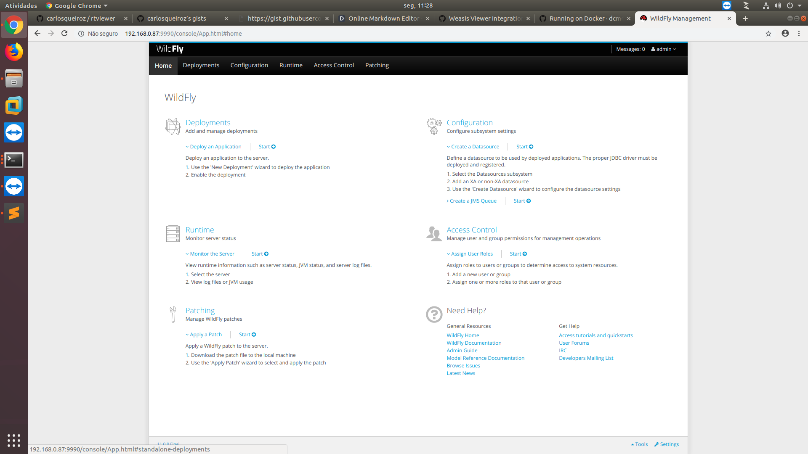
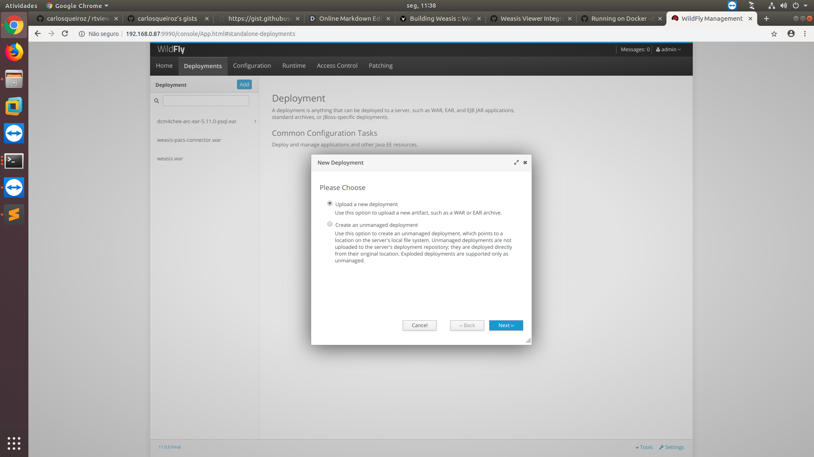

[](https://opensource.org/licenses/EPL-2.0) [](https://travis-ci.com/nroduit/Weasis)   
[](https://sonarcloud.io/component_measures?id=org.weasis%3Aweasis-framework) [](https://sonarcloud.io/component_measures?id=org.weasis%3Aweasis-framework) [](https://sonarcloud.io/component_measures?id=org.weasis%3Aweasis-framework) [](https://sonarcloud.io/component_measures?id=org.weasis%3Aweasis-framework) [](https://sonarcloud.io/dashboard?id=org.weasis%3Aweasis-framework)    

O RT Connect Viewer é baseado no visualizador Weasis em Java


* [Informações sobre o Weasis](https://nroduit.github.io)

* [Issues](https://github.com/nroduit/Weasis/issues) ([Old Issue Tracker](https://dcm4che.atlassian.net/projects/WEA))

# Instalando Ambiente de Desenvolvimento
``` bash
echo "Instalando Java, Maven e Eclipse para Ubuntu 16.06"
sudo sh install-dev-env.sh
```

# Build Weasis

O RT Connect Viewer é baseando no  Weasis 3.x.x (Necessitando de  Java 8+)

Documentação [Oficial do Weasis](https://nroduit.github.io/en/getting-started/building-weasis)
``` bash
echo "Clonando o Projeto"
git clone https://github.com/carlosqueiroz/rtviewer
cd rtviewer/
echo "Rodando o Maven"
mvn clean install
echo "Construindo o Aplicativo"
cd weasis-distributions
mvn clean package -Dportable=true -P pack200
 ```
# Executando Aplicativo Gerado
Acesse a pasta rtviewer/weasis-distributions/target/portable-dist/
Nesta Pasta, você poderá executar o aplicativo para Linux, Windows e MAC.

# Executando Aplicativo JNLP no Servidor

Foi gerado em  rtviewer/weasis-distributions/target/web-dist/ um arquivo .war, este arquivo deve ser enviado para o Wildfly para que o software seja executado em conjunto com o servidor de armazenamento de imagens.
Acesse o Wildfly 
http://{IP_servidor}:9990/console/App.html
ou
http://192.168.0.87:9990/console/App.html
Login:admin
Senha:admin

Após o Login Clique na Aba Deployment


E agora envie o arquivo  gerado  rtviewer/weasis-distributions/target/web-dist/{arquivo}.war clicando em ADD



O Arquivo weasis-pacs-connector.war  que está  listado no Wildfly pode ser construido a partir de : https://github.com/nroduit/weasis-pacs-connector

Os arquivos de Propriedades que fazem a conexão (gerando o URL para download) do wildfly com o weasis estão em
estão em :
https://github.com/carlosqueiroz/rt/tree/master/docker/pacs/wildfly/standalone/configuration

e são atualizados no conteiner docker do rtconnect em toda reconstrução, conforme ilustra a linha:

https://github.com/carlosqueiroz/rt/blob/master/docker/docker-compose.yml#L809 


